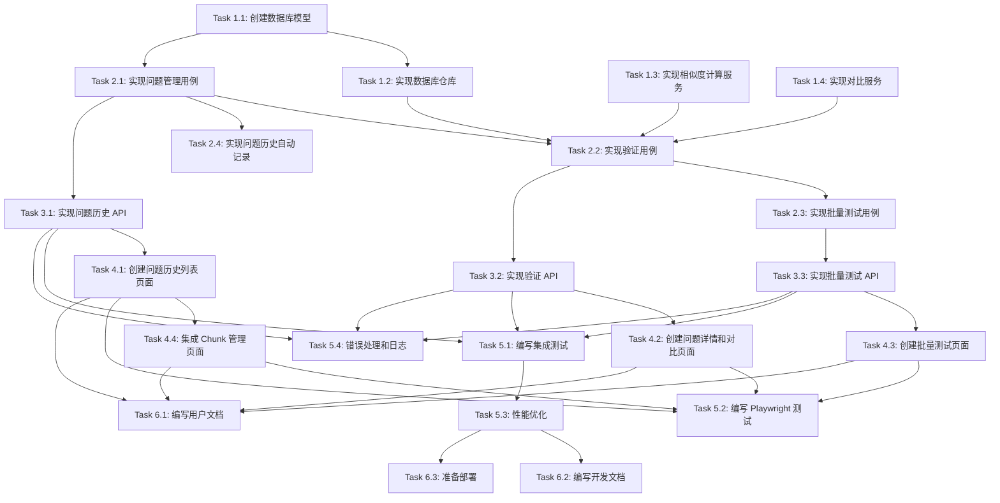

# Tasks: Chunk Optimization Verification

## Task Breakdown

### Phase 1: 基础设施搭建 (Foundation)

#### Task 1.1: 创建数据库模型
**Priority**: High  
**Estimated Time**: 2 hours  
**Dependencies**: None

**Description**: 创建问题历史和验证记录的数据模型

**Subtasks**:
1. 在 `src/aitechpioneer/domain/models.py` 中添加 `Question` 模型
2. 在 `src/aitechpioneer/domain/models.py` 中添加 `VerificationRecord` 模型
3. 在 `src/aitechpioneer/domain/models.py` 中添加 `QuestionStatus` 枚举
4. 在 `src/aitechpioneer/domain/models.py` 中添加 `EffectRating` 枚举
5. 在 `src/aitechpioneer/domain/ports.py` 中添加 `QuestionRepository` 接口
6. 在 `src/aitechpioneer/domain/ports.py` 中添加 `VerificationRepository` 接口

**Acceptance Criteria**:
- [ ] `Question` 模型包含所有必需的字段（question_id, question, answer, retrieved_chunks, etc.）
- [ ] `VerificationRecord` 模型包含所有必需的字段（verification_id, question_id, similarity_score, etc.）
- [ ] `QuestionStatus` 枚举包含所有状态（none, pending, optimized, verified）
- [ ] `EffectRating` 枚举包含所有评级（better, same, worse）
- [ ] `QuestionRepository` 接口定义了所有必需的方法（create, get_by_id, get_all, update, delete）
- [ ] `VerificationRepository` 接口定义了所有必需的方法（create, get_by_id, get_by_question_id, etc.）

**Files to Modify**:
- [src/aitechpioneer/domain/models.py](file:///Users/lancer.zhang/ProjectNIO/aitechpioneer/src/aitechpioneer/domain/models.py)
- [src/aitechpioneer/domain/ports.py](file:///Users/lancer.zhang/ProjectNIO/aitechpioneer/src/aitechpioneer/domain/ports.py)

---

#### Task 1.2: 实现数据库仓库
**Priority**: High  
**Estimated Time**: 3 hours  
**Dependencies**: Task 1.1

**Description**: 实现 Qdrant 数据库仓库，存储和检索问题历史和验证记录

**Subtasks**:
1. 在 `src/aitechpioneer/infrastructure/db.py` 中实现 `QuestionRepository`
2. 在 `src/aitechpioneer/infrastructure/db.py` 中实现 `VerificationRepository`
3. 创建 `question_history` collection
4. 创建 `verification_records` collection
5. 为两个 collection 创建必要的索引
6. 实现分页查询功能
7. 实现过滤和搜索功能

**Acceptance Criteria**:
- [ ] `QuestionRepository` 实现了所有接口方法
- [ ] `VerificationRepository` 实现了所有接口方法
- [ ] `question_history` collection 创建成功
- [ ] `verification_records` collection 创建成功
- [ ] 索引创建成功（created_at, optimization_status, question_id, etc.）
- [ ] 分页查询功能正常工作
- [ ] 过滤和搜索功能正常工作

**Files to Modify**:
- [src/aitechpioneer/infrastructure/db.py](file:///Users/lancer.zhang/ProjectNIO/aitechpioneer/src/aitechpioneer/infrastructure/db.py)

---

#### Task 1.3: 实现相似度计算服务
**Priority**: High  
**Estimated Time**: 2 hours  
**Dependencies**: None

**Description**: 实现文本相似度计算服务，用于对比优化前后的答案

**Subtasks**:
1. 安装 sentence-transformers 库
2. 在 `src/aitechpioneer/domain/services.py` 中创建 `SimilarityService`
3. 实现语义相似度计算（使用 sentence-transformers）
4. 实现文本相似度计算（使用 difflib）
5. 实现综合相似度计算（语义 70% + 文本 30%）
6. 添加单元测试

**Acceptance Criteria**:
- [ ] `SimilarityService` 创建成功
- [ ] 语义相似度计算正确
- [ ] 文本相似度计算正确
- [ ] 综合相似度计算正确
- [ ] 单元测试通过

**Files to Modify**:
- [src/aitechpioneer/domain/services.py](file:///Users/lancer.zhang/ProjectNIO/aitechpioneer/src/aitechpioneer/domain/services.py)
- [tests/test_similarity_service.py](file:///Users/lancer.zhang/ProjectNIO/aitechpioneer/tests/test_similarity_service.py) (新建)

---

#### Task 1.4: 实现对比服务
**Priority**: High  
**Estimated Time**: 2 hours  
**Dependencies**: Task 1.1

**Description**: 实现对比服务，用于对比优化前后的 chunks 和答案

**Subtasks**:
1. 在 `src/aitechpioneer/domain/services.py` 中创建 `ComparisonService`
2. 实现 chunk 变化检测（新增、删除、相同）
3. 实现答案对比功能
4. 实现评分变化计算
5. 添加单元测试

**Acceptance Criteria**:
- [ ] `ComparisonService` 创建成功
- [ ] chunk 变化检测正确
- [ ] 答案对比功能正常
- [ ] 评分变化计算正确
- [ ] 单元测试通过

**Files to Modify**:
- [src/aitechpioneer/domain/services.py](file:///Users/lancer.zhang/ProjectNIO/aitechpioneer/src/aitechpioneer/domain/services.py)
- [tests/test_comparison_service.py](file:///Users/lancer.zhang/ProjectNIO/aitechpioneer/tests/test_comparison_service.py) (新建)

---

### Phase 2: 业务逻辑实现 (Business Logic)

#### Task 2.1: 实现问题管理用例
**Priority**: High  
**Estimated Time**: 3 hours  
**Dependencies**: Task 1.1, Task 1.2

**Description**: 实现问题管理的业务逻辑

**Subtasks**:
1. 在 `src/aitechpioneer/application/use_cases.py` 中创建 `QuestionManagementUseCase`
2. 实现创建问题记录功能
3. 实现获取问题详情功能
4. 实现获取问题列表功能（支持分页、过滤、搜索）
5. 实现标记问题状态功能
6. 实现删除问题功能
7. 实现用户反馈处理功能：
   - 处理用户反馈"问题已解决"：设置 is_optimization_target = false，状态 = resolved
   - 处理用户反馈"问题未解决"：设置 is_optimization_target = true，状态 = discovered，记录 optimization_target_since
8. 实现获取待优化目标列表功能（仅返回 is_optimization_target = true 的问题）
9. 添加单元测试

**Acceptance Criteria**:
- [ ] `QuestionManagementUseCase` 创建成功
- [ ] 创建问题记录功能正常
- [ ] 获取问题详情功能正常
- [ ] 获取问题列表功能正常（支持分页、过滤、搜索）
- [ ] 标记问题状态功能正常
- [ ] 删除问题功能正常
- [ ] 用户反馈"问题已解决"处理正确（is_optimization_target = false，状态 = resolved）
- [ ] 用户反馈"问题未解决"处理正确（is_optimization_target = true，状态 = discovered，记录 optimization_target_since）
- [ ] 获取待优化目标列表功能正常（仅返回 is_optimization_target = true 的问题）
- [ ] 单元测试通过

**Files to Modify**:
- [src/aitechpioneer/application/use_cases.py](file:///Users/lancer.zhang/ProjectNIO/aitechpioneer/src/aitechpioneer/application/use_cases.py)
- [tests/test_question_management_use_case.py](file:///Users/lancer.zhang/ProjectNIO/aitechpioneer/tests/test_question_management_use_case.py) (新建)

---

#### Task 2.2: 实现验证用例
**Priority**: High  
**Estimated Time**: 4 hours  
**Dependencies**: Task 1.1, Task 1.2, Task 1.3, Task 1.4, Task 2.1

**Description**: 实现验证功能的业务逻辑

**Subtasks**:
1. 在 `src/aitechpioneer/application/use_cases.py` 中创建 `VerificationUseCase`
2. 实现重新测试问题功能（复用 RAG 系统的检索和生成逻辑）
3. 实现创建验证记录功能
4. 实现对比优化前后结果功能
5. 实现评估优化效果功能
6. 实现获取验证记录功能
7. 添加单元测试

**Acceptance Criteria**:
- [ ] `VerificationUseCase` 创建成功
- [ ] 重新测试问题功能正常（复用 RAG 系统）
- [ ] 创建验证记录功能正常
- [ ] 对比优化前后结果功能正常
- [ ] 评估优化效果功能正常
- [ ] 获取验证记录功能正常
- [ ] 单元测试通过

**Files to Modify**:
- [src/aitechpioneer/application/use_cases.py](file:///Users/lancer.zhang/ProjectNIO/aitechpioneer/src/aitechpioneer/application/use_cases.py)
- [tests/test_verification_use_case.py](file:///Users/lancer.zhang/ProjectNIO/aitechpioneer/tests/test_verification_use_case.py) (新建)

---

#### Task 2.3: 实现批量测试用例
**Priority**: Medium  
**Estimated Time**: 3 hours  
**Dependencies**: Task 2.2

**Description**: 实现批量测试功能的业务逻辑

**Subtasks**:
1. 在 `src/aitechpioneer/application/use_cases.py` 中创建 `BatchTestUseCase`
2. 实现批量重新测试功能（使用 asyncio 并发控制）
3. 实现批量测试进度跟踪功能
4. 实现批量标记优化效果功能
5. 实现批量测试结果汇总功能
6. 添加单元测试

**Acceptance Criteria**:
- [ ] `BatchTestUseCase` 创建成功
- [ ] 批量重新测试功能正常（并发控制）
- [ ] 批量测试进度跟踪功能正常
- [ ] 批量标记优化效果功能正常
- [ ] 批量测试结果汇总功能正常
- [ ] 单元测试通过

**Files to Modify**:
- [src/aitechpioneer/application/use_cases.py](file:///Users/lancer.zhang/ProjectNIO/aitechpioneer/src/aitechpioneer/application/use_cases.py)
- [tests/test_batch_test_use_case.py](file:///Users/lancer.zhang/ProjectNIO/aitechpioneer/tests/test_batch_test_use_case.py) (新建)

---

#### Task 2.4: 实现问题历史自动记录
**Priority**: High  
**Estimated Time**: 2 hours  
**Dependencies**: Task 2.1

**Description**: 在问答 API 中添加中间件，自动记录问题历史

**Subtasks**:
1. 在 `src/aitechpioneer/interfaces/api.py` 中创建问题历史中间件
2. 在问答 API 中集成中间件
3. 实现自动记录问题、答案、检索 chunks 功能
4. 实现自动记录检索参数和生成参数功能
5. 添加集成测试

**Acceptance Criteria**:
- [ ] 问题历史中间件创建成功
- [ ] 问答 API 集成中间件成功
- [ ] 自动记录问题、答案、检索 chunks 功能正常
- [ ] 自动记录检索参数和生成参数功能正常
- [ ] 集成测试通过

**Files to Modify**:
- [src/aitechpioneer/interfaces/api.py](file:///Users/lancer.zhang/ProjectNIO/aitechpioneer/src/aitechpioneer/interfaces/api.py)
- [tests/test_question_history_middleware.py](file:///Users/lancer.zhang/ProjectNIO/aitechpioneer/tests/test_question_history_middleware.py) (新建)

---

### Phase 3: API 端点实现 (API Implementation)

#### Task 3.1: 实现问题历史 API
**Priority**: High  
**Estimated Time**: 3 hours  
**Dependencies**: Task 2.1

**Description**: 实现问题历史相关的 API 端点

**Subtasks**:
1. 实现 `GET /api/questions` 端点（获取问题列表）
2. 实现 `GET /api/questions/{question_id}` 端点（获取问题详情）
3. 实现 `POST /api/questions/{question_id}/mark` 端点（标记问题状态）
4. 实现 `DELETE /api/questions/{question_id}` 端点（删除问题）
5. 添加请求和响应模型
6. 添加 API 文档
7. 添加集成测试

**Acceptance Criteria**:
- [ ] `GET /api/questions` 端点正常工作（支持分页、过滤、搜索）
- [ ] `GET /api/questions/{question_id}` 端点正常工作
- [ ] `POST /api/questions/{question_id}/mark` 端点正常工作
- [ ] `DELETE /api/questions/{question_id}` 端点正常工作
- [ ] 请求和响应模型定义正确
- [ ] API 文档完整
- [ ] 集成测试通过

**Files to Modify**:
- [src/aitechpioneer/interfaces/api.py](file:///Users/lancer.zhang/ProjectNIO/aitechpioneer/src/aitechpioneer/interfaces/api.py)
- [tests/test_question_api.py](file:///Users/lancer.zhang/ProjectNIO/aitechpioneer/tests/test_question_api.py) (新建)

---

#### Task 3.2: 实现验证 API
**Priority**: High  
**Estimated Time**: 3 hours  
**Dependencies**: Task 2.2

**Description**: 实现验证相关的 API 端点

**Subtasks**:
1. 实现 `POST /api/questions/{question_id}/retest` 端点（重新测试问题）
2. 实现 `POST /api/questions/{question_id}/verification/{verification_id}/rate` 端点（评估优化效果）
3. 实现 `GET /api/questions/{question_id}/verifications` 端点（获取验证记录列表）
4. 添加请求和响应模型
5. 添加 API 文档
6. 添加集成测试

**Acceptance Criteria**:
- [ ] `POST /api/questions/{question_id}/retest` 端点正常工作
- [ ] `POST /api/questions/{question_id}/verification/{verification_id}/rate` 端点正常工作
- [ ] `GET /api/questions/{question_id}/verifications` 端点正常工作
- [ ] 请求和响应模型定义正确
- [ ] API 文档完整
- [ ] 集成测试通过

**Files to Modify**:
- [src/aitechpioneer/interfaces/api.py](file:///Users/lancer.zhang/ProjectNIO/aitechpioneer/src/aitechpioneer/interfaces/api.py)
- [tests/test_verification_api.py](file:///Users/lancer.zhang/ProjectNIO/aitechpioneer/tests/test_verification_api.py) (新建)

---

#### Task 3.3: 实现批量测试 API
**Priority**: Medium  
**Estimated Time**: 2 hours  
**Dependencies**: Task 2.3

**Description**: 实现批量测试相关的 API 端点

**Subtasks**:
1. 实现 `POST /api/questions/batch-retest` 端点（批量重新测试）
2. 实现 `GET /api/batch/{batch_id}/status` 端点（获取批量测试状态）
3. 实现 `GET /api/batch/{batch_id}/results` 端点（获取批量测试结果）
4. 添加请求和响应模型
5. 添加 API 文档
6. 添加集成测试

**Acceptance Criteria**:
- [ ] `POST /api/questions/batch-retest` 端点正常工作
- [ ] `GET /api/batch/{batch_id}/status` 端点正常工作
- [ ] `GET /api/batch/{batch_id}/results` 端点正常工作
- [ ] 请求和响应模型定义正确
- [ ] API 文档完整
- [ ] 集成测试通过

**Files to Modify**:
- [src/aitechpioneer/interfaces/api.py](file:///Users/lancer.zhang/ProjectNIO/aitechpioneer/src/aitechpioneer/interfaces/api.py)
- [tests/test_batch_test_api.py](file:///Users/lancer.zhang/ProjectNIO/aitechpioneer/tests/test_batch_test_api.py) (新建)

---

### Phase 4: 前端实现 (Frontend Implementation)

#### Task 4.1: 创建问题历史列表页面
**Priority**: High  
**Estimated Time**: 4 hours  
**Dependencies**: Task 3.1

**Description**: 创建问题历史列表页面，显示所有问题历史

**Subtasks**:
1. 创建 `frontend/static/questions.html` 页面
2. 创建 `frontend/static/js/questions.js` 脚本
3. 实现问题列表展示
4. 实现分页功能
5. 实现过滤功能（按状态、时间范围）
6. 实现搜索功能（按关键词）
7. 实现标记问题功能
8. 实现批量选择功能
9. 添加样式

**Acceptance Criteria**:
- [ ] 问题历史列表页面创建成功
- [ ] 问题列表展示正常
- [ ] 分页功能正常
- [ ] 过滤功能正常（按状态、时间范围）
- [ ] 搜索功能正常（按关键词）
- [ ] 标记问题功能正常
- [ ] 批量选择功能正常
- [ ] 样式美观

**Files to Create**:
- [frontend/static/questions.html](file:///Users/lancer.zhang/ProjectNIO/aitechpioneer/frontend/static/questions.html)
- [frontend/static/js/questions.js](file:///Users/lancer.zhang/ProjectNIO/aitechpioneer/frontend/static/js/questions.js)

---

#### Task 4.2: 创建问题详情和对比页面
**Priority**: High  
**Estimated Time**: 5 hours  
**Dependencies**: Task 3.2

**Description**: 创建问题详情和对比页面，显示优化前后的对比

**Subtasks**:
1. 创建 `frontend/static/question-detail.html` 页面
2. 创建 `frontend/static/js/question-detail.js` 脚本
3. 实现问题详情展示
4. 实现原始答案和新答案对比
5. 实现答案差异高亮
6. 实现原始 chunks 和新 chunks 对比
7. 实现相似度评分展示
8. 实现优化效果评估功能
9. 实现评论功能
10. 添加样式

**Acceptance Criteria**:
- [ ] 问题详情和对比页面创建成功
- [ ] 问题详情展示正常
- [ ] 原始答案和新答案对比正常
- [ ] 答案差异高亮正常
- [ ] 原始 chunks 和新 chunks 对比正常
- [ ] 相似度评分展示正常
- [ ] 优化效果评估功能正常
- [ ] 评论功能正常
- [ ] 样式美观

**Files to Create**:
- [frontend/static/question-detail.html](file:///Users/lancer.zhang/ProjectNIO/aitechpioneer/frontend/static/question-detail.html)
- [frontend/static/js/question-detail.js](file:///Users/lancer.zhang/ProjectNIO/aitechpioneer/frontend/static/js/question-detail.js)

---

#### Task 4.3: 创建批量测试页面
**Priority**: Medium  
**Estimated Time**: 3 hours  
**Dependencies**: Task 3.3

**Description**: 创建批量测试页面，显示批量测试进度和结果

**Subtasks**:
1. 创建 `frontend/static/batch-test.html` 页面
2. 创建 `frontend/static/js/batch-test.js` 脚本
3. 实现批量测试选择功能
4. 实现批量测试进度展示
5. 实现批量测试结果展示
6. 实现批量标记优化效果功能
7. 实现批量导出功能
8. 添加样式

**Acceptance Criteria**:
- [ ] 批量测试页面创建成功
- [ ] 批量测试选择功能正常
- [ ] 批量测试进度展示正常
- [ ] 批量测试结果展示正常
- [ ] 批量标记优化效果功能正常
- [ ] 批量导出功能正常
- [ ] 样式美观

**Files to Create**:
- [frontend/static/batch-test.html](file:///Users/lancer.zhang/ProjectNIO/aitechpioneer/frontend/static/batch-test.html)
- [frontend/static/js/batch-test.js](file:///Users/lancer.zhang/ProjectNIO/aitechpioneer/frontend/static/js/batch-test.js)

---

#### Task 4.4: 集成 Chunk 管理页面
**Priority**: High  
**Estimated Time**: 2 hours  
**Dependencies**: Task 4.1

**Description**: 在 chunk 管理页面中集成验证入口

**Subtasks**:
1. 修改 `frontend/static/chunks.html` 页面
2. 修改 `frontend/static/js/chunks.js` 脚本
3. 在 chunk 合并成功后显示"立即验证"按钮
4. 点击"立即验证"按钮后跳转到问题历史页面
5. 推荐标记为"待优化"的问题
6. 添加样式

**Acceptance Criteria**:
- [ ] chunk 管理页面集成验证入口成功
- [ ] chunk 合并成功后显示"立即验证"按钮
- [ ] 点击"立即验证"按钮后跳转到问题历史页面
- [ ] 推荐标记为"待优化"的问题
- [ ] 样式美观

**Files to Modify**:
- [frontend/static/chunks.html](file:///Users/lancer.zhang/ProjectNIO/aitechpioneer/frontend/static/chunks.html)
- [frontend/static/js/chunks.js](file:///Users/lancer.zhang/ProjectNIO/aitechpioneer/frontend/static/js/chunks.js)

---

### Phase 5: 测试和优化 (Testing and Optimization)

#### Task 5.1: 编写集成测试
**Priority**: High  
**Estimated Time**: 4 hours  
**Dependencies**: Task 3.1, Task 3.2, Task 3.3

**Description**: 编写端到端的集成测试

**Subtasks**:
1. 创建 `tests/test_verification_integration.py` 文件
2. 编写问题历史记录测试
3. 编写重新测试功能测试
4. 编写优化效果评估测试
5. 编写批量测试功能测试
6. 编写与 chunk 管理集成测试

**Acceptance Criteria**:
- [ ] 集成测试文件创建成功
- [ ] 问题历史记录测试通过
- [ ] 重新测试功能测试通过
- [ ] 优化效果评估测试通过
- [ ] 批量测试功能测试通过
- [ ] 与 chunk 管理集成测试通过

**Files to Create**:
- [tests/test_verification_integration.py](file:///Users/lancer.zhang/ProjectNIO/aitechpioneer/tests/test_verification_integration.py)

---

#### Task 5.2: 编写 Playwright 测试
**Priority**: Medium  
**Estimated Time**: 4 hours  
**Dependencies**: Task 4.1, Task 4.2, Task 4.3, Task 4.4

**Description**: 编写 Playwright 端到端测试

**Subtasks**:
1. 创建 `tests/test_verification_playwright.py` 文件
2. 编写问题历史列表页面测试
3. 编写问题详情和对比页面测试
4. 编写批量测试页面测试
5. 编写 chunk 管理页面集成测试
6. 创建测试用例文档

**Acceptance Criteria**:
- [ ] Playwright 测试文件创建成功
- [ ] 问题历史列表页面测试通过
- [ ] 问题详情和对比页面测试通过
- [ ] 批量测试页面测试通过
- [ ] chunk 管理页面集成测试通过
- [ ] 测试用例文档完整

**Files to Create**:
- [tests/test_verification_playwright.py](file:///Users/lancer.zhang/ProjectNIO/aitechpioneer/tests/test_verification_playwright.py)
- [tests/test_verification_cases.md](file:///Users/lancer.zhang/ProjectNIO/aitechpioneer/tests/test_verification_cases.md)

---

#### Task 5.3: 性能优化
**Priority**: Medium  
**Estimated Time**: 3 hours  
**Dependencies**: Task 5.1

**Description**: 优化系统性能

**Subtasks**:
1. 优化问题历史查询性能（使用 Qdrant 过滤和分页）
2. 优化批量测试性能（使用连接池和缓存）
3. 优化相似度计算性能（使用批量处理）
4. 添加性能监控
5. 进行性能测试

**Acceptance Criteria**:
- [ ] 问题历史查询响应时间 < 1s
- [ ] 重新测试响应时间 < 3s
- [ ] 批量测试支持 10+ 问题并发
- [ ] 答案相似度计算 < 500ms
- [ ] 性能监控正常工作
- [ ] 性能测试通过

**Files to Modify**:
- [src/aitechpioneer/infrastructure/db.py](file:///Users/lancer.zhang/ProjectNIO/aitechpioneer/src/aitechpioneer/infrastructure/db.py)
- [src/aitechpioneer/application/use_cases.py](file:///Users/lancer.zhang/ProjectNIO/aitechpioneer/src/aitechpioneer/application/use_cases.py)
- [src/aitechpioneer/domain/services.py](file:///Users/lancer.zhang/ProjectNIO/aitechpioneer/src/aitechpioneer/domain/services.py)

---

#### Task 5.4: 错误处理和日志
**Priority**: High  
**Estimated Time**: 2 hours  
**Dependencies**: Task 3.1, Task 3.2, Task 3.3

**Description**: 完善错误处理和日志记录

**Subtasks**:
1. 添加统一的错误处理中间件
2. 添加详细的日志记录
3. 添加输入验证
4. 添加错误提示
5. 编写错误处理测试

**Acceptance Criteria**:
- [ ] 统一错误处理中间件正常工作
- [ ] 详细日志记录正常
- [ ] 输入验证正常
- [ ] 错误提示友好
- [ ] 错误处理测试通过

**Files to Modify**:
- [src/aitechpioneer/interfaces/api.py](file:///Users/lancer.zhang/ProjectNIO/aitechpioneer/src/aitechpioneer/interfaces/api.py)
- [tests/test_error_handling.py](file:///Users/lancer.zhang/ProjectNIO/aitechpioneer/tests/test_error_handling.py) (新建)

---

### Phase 6: 文档和部署 (Documentation and Deployment)

#### Task 6.1: 编写用户文档
**Priority**: Medium  
**Estimated Time**: 2 hours  
**Dependencies**: Task 4.1, Task 4.2, Task 4.3, Task 4.4

**Description**: 编写用户使用文档

**Subtasks**:
1. 创建 `docs/verification_user_guide.md` 文档
2. 编写问题历史查看指南
3. 编写重新测试指南
4. 编写优化效果评估指南
5. 编写批量测试指南
6. 添加截图和示例

**Acceptance Criteria**:
- [ ] 用户文档创建成功
- [ ] 问题历史查看指南完整
- [ ] 重新测试指南完整
- [ ] 优化效果评估指南完整
- [ ] 批量测试指南完整
- [ ] 截图和示例清晰

**Files to Create**:
- [docs/verification_user_guide.md](file:///Users/lancer.zhang/ProjectNIO/aitechpioneer/docs/verification_user_guide.md)

---

#### Task 6.2: 编写开发文档
**Priority**: Low  
**Estimated Time**: 2 hours  
**Dependencies**: All previous tasks

**Description**: 编写开发文档

**Subtasks**:
1. 创建 `docs/verification_dev_guide.md` 文档
2. 编写架构说明
3. 编写 API 文档
4. 编写数据库设计文档
5. 编写部署指南

**Acceptance Criteria**:
- [ ] 开发文档创建成功
- [ ] 架构说明完整
- [ ] API 文档完整
- [ ] 数据库设计文档完整
- [ ] 部署指南完整

**Files to Create**:
- [docs/verification_dev_guide.md](file:///Users/lancer.zhang/ProjectNIO/aitechpioneer/docs/verification_dev_guide.md)

---

#### Task 6.3: 准备部署
**Priority**: High  
**Estimated Time**: 2 hours  
**Dependencies**: All previous tasks

**Description**: 准备系统部署

**Subtasks**:
1. 更新依赖列表
2. 创建数据库迁移脚本
3. 创建部署检查清单
4. 进行部署测试
5. 修复部署问题

**Acceptance Criteria**:
- [ ] 依赖列表更新完成
- [ ] 数据库迁移脚本创建成功
- [ ] 部署检查清单完整
- [ ] 部署测试通过
- [ ] 部署问题修复完成

**Files to Modify**:
- [pyproject.toml](file:///Users/lancer.zhang/ProjectNIO/aitechpioneer/pyproject.toml)
- [scripts/migrate_verification.py](file:///Users/lancer.zhang/ProjectNIO/aitechpioneer/scripts/migrate_verification.py) (新建)

---

## Task Dependencies

## Estimated Timeline

| Phase | Tasks | Estimated Time | Start Date | End Date |
|-------|-------|----------------|------------|----------|
| Phase 1: 基础设施搭建 | 1.1, 1.2, 1.3, 1.4 | 9 hours | Day 1 | Day 2 |
| Phase 2: 业务逻辑实现 | 2.1, 2.2, 2.3, 2.4 | 12 hours | Day 3 | Day 4 |
| Phase 3: API 端点实现 | 3.1, 3.2, 3.3 | 8 hours | Day 5 | Day 5 |
| Phase 4: 前端实现 | 4.1, 4.2, 4.3, 4.4 | 14 hours | Day 6 | Day 8 |
| Phase 5: 测试和优化 | 5.1, 5.2, 5.3, 5.4 | 13 hours | Day 9 | Day 10 |
| Phase 6: 文档和部署 | 6.1, 6.2, 6.3 | 6 hours | Day 11 | Day 11 |

**Total Estimated Time**: 62 hours (approximately 8 working days)

## Risk Assessment

| Risk | Impact | Probability | Mitigation |
|------|--------|-------------|------------|
| sentence-transformers 模型下载失败 | High | Low | 使用本地缓存或镜像源 |
| Qdrant 性能不足 | Medium | Low | 优化查询，使用索引 |
| 批量测试并发控制问题 | Medium | Medium | 使用 asyncio.Semaphore |
| 前端样式不一致 | Low | Medium | 使用统一的设计系统 |
| 集成测试失败 | High | Medium | 提前进行集成测试 |
| 性能不达标 | Medium | Low | 提前进行性能测试和优化 |

## Success Criteria

- [ ] 所有任务完成
- [ ] 所有单元测试通过
- [ ] 所有集成测试通过
- [ ] 所有 Playwright 测试通过
- [ ] 性能指标达标
- [ ] 用户文档完整
- [ ] 开发文档完整
- [ ] 部署成功
